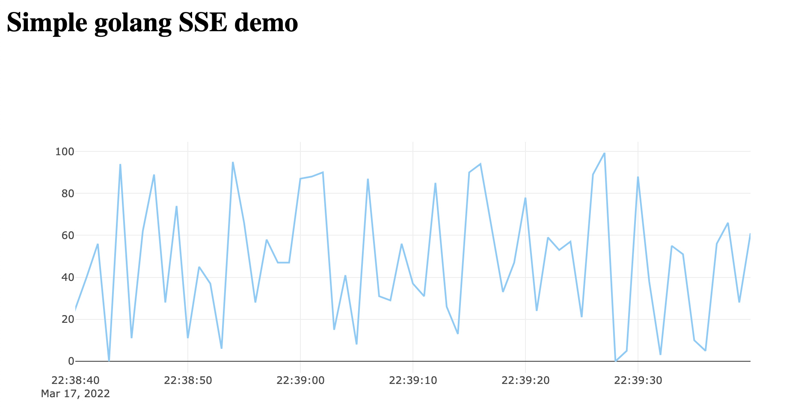

# Golang SSE Demo

A brief demo of real-time plotting with Plotly, Go, and server-side events.

## Overview

I first learned about Server-Sent Events from [@mroth](https://twitter.com/mroth)'s [How I Built Emojitracker](https://medium.com/@mroth/how-i-built-emojitracker-179cfd8238ac) and have been intrigued ever since.

However, it wasn't until I came across [@benbjohnson](https://twitter.com/benbjohnson)'s [litestream-read-replica-demo](https://github.com/benbjohnson/litestream-read-replica-demo) that I realized _just how easy_ they were to use. I thought there was all sorts of complexity, but no!

It's really simple...all you need to do is create a new `EventSource` in your JavaScript and feed it updates!

```javascript
var sse = new EventSource("/api/stream");
sse.addEventListener("update", function (e) {
  // Do something!
});
```

## Demo

This repo shows how to use Go to send events to the browser and, of course, draw a real-time chart with Plotly. :)

```shell
git clone https://github.com/dacort/golang-sse-demo.git
cd golang-sse-demo
go run *.go
```

Then browse to http://localhost:3000

💥


